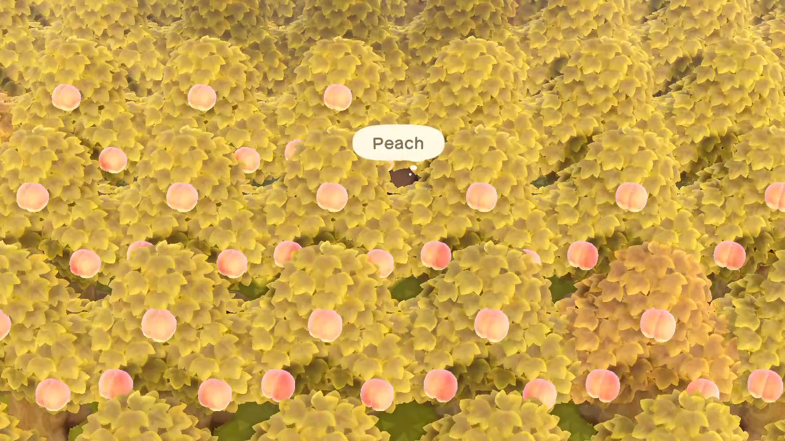
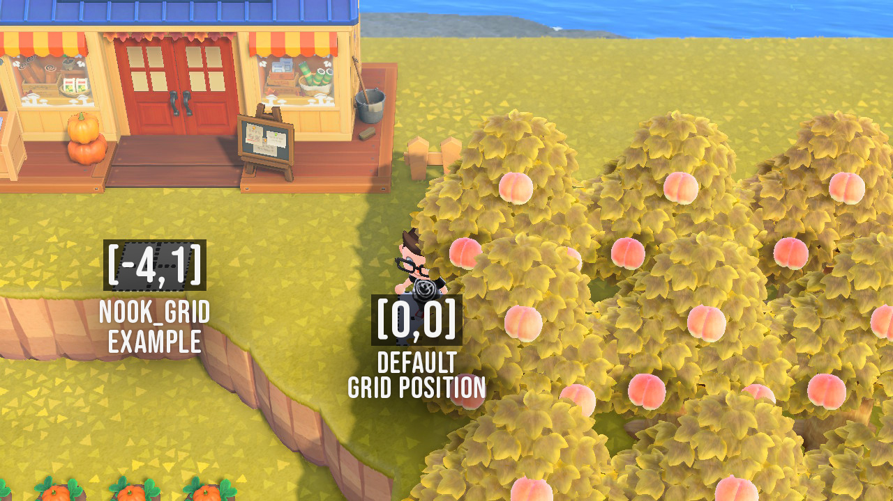

import demoPoster from './acnh-automator-poster.jpg'

## Planting Hundreds of Virtual Trees

Like many other gamers, I spent many hours playing Animal Crossing New Horizons when it launched. Having played several games in this series, I knew a quick way to earn in-game money, called "Bells", was to plant fruit trees and sell the fruit at Tom Nook's store.

After planting enough virtual trees to make about 500,000 Bells every three days, I ran into another problem...**it was taking way too long.**

### Using Python to Automate the Boring Stuff

As a fun programming challenge, I decided to automate this process and created **ACNH Automator**.

I came across the the [joycontrol](https://github.com/mart1nro/joycontrol) library on GitHub, a Python based toolset that emulates a Nintendo Switch controller over Bluetooth, and knew this would be the perfect place to start.

This project was also a great way to learn Python, which I hadn't yet used at the time. While looking through the code in author [mart1nro's](https://github.com/mart1nro/) project however, I saw that it used a familiar Object-oriented design pattern I learned while working with JavaScript and Ruby during my time at Flatiron School.

After a few iterations, I came up with a solution I was happy with and [published the results](https://github.com/artwilton/joycontrol-acnh-automator) to GitHub.

### ACNH Automator in Action

<InlineVideo
  video="https://user-images.githubusercontent.com/69938486/209448850-7c3276af-3160-4889-8737-b6b62cb2f2e7.mp4"
  poster={demoPoster}
>
</InlineVideo>

Since working on ACNH Automator, I've even automated other video game tasks with Python such as solving puzzles in Tunic, and farming runes in Elden Ring.

## How it Works

The full instructions for how ACNH Automator works can be found on [GitHub](https://github.com/artwilton/joycontrol-acnh-automator), but the basic requirements are to have Python and the joycontrol library installed on a Linux OS. Personally I use VirtualBox to run Ubuntu in a VM on MacOS, along with a USB Bluetooth Adapter.

As of now, ACNH Automator has one available automation task called ***pick_trees*** which allows you to automatically pick fruit from trees and sell the fruit at Nook's Cranny. I hope to design more features in the future to help with things like repetitive crafting tasks.

### Utilizing a Grid to Keep Track of Player Position

Animal Crossing uses a built-in grid for spacing and movement, so I designed my own grid system in Python to easily keep track of where the player moves on screen.

For now, ACNH Automator assumes that trees are spaced exactly one grid space apart from each other in the ***x*** and ***y*** direction. Grid space is measured in `[x,y]` and assumes that `[0,0]` is the space directly to the left of the top-left tree. The `nook_grid` value should be exactly 2 spaces below Nook's Cranny to avoid running into the building by accident.

### Set the Defaults, and ACNH Automator Handles The Rest

Referenced in the GitHub instructions, I've included a way to set some default parameters based on your current inventory and map setup.

Once these are set you can run `pick_trees` as a joycontrol command, and your character will now:

- Navigate through the grid, harvesting fruit from each tree in the x direction until it reaches the last tree in the row.

- Travel down two spaces in the y direction to proceed to the next row, and change direction accordingly.

- Stop picking trees when a threshold is met for the amount of fruit that can be safely stored in your inventory.

- Travel to Nook's Cranny to sell all of the fruit, and travel back to the next tree that needs to be picked.

- Repeat this process until all fruit is harvested and sold.

  
---
  
For more information [check out the project on GitHub](https://github.com/artwilton/joycontrol-acnh-automator) or read my [blog post](https://medium.com/swlh/picking-peaches-with-python-in-animal-crossing-new-horizons-75274706ee79), published by "The Startup" on Medium.